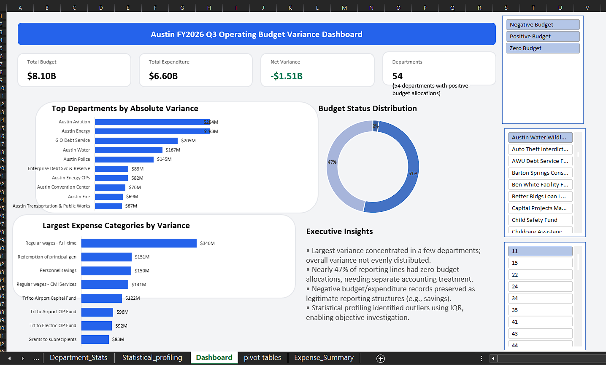
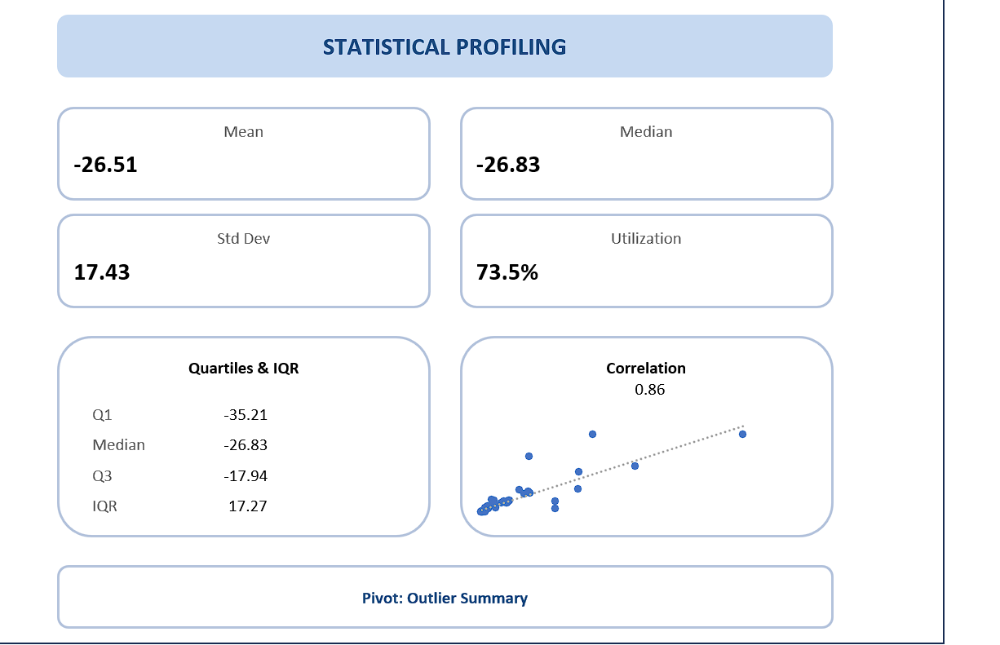

# Austin FY2026 Operating Budget Variance Analysis

**Tools:** Excel, PostgreSQL, Power Query, SQL, Statistics

## Overview
Analyzed the City of Austin FY2026 Q3 operating budget to compare budgeted allocations with actual expenditures across departments, funds, programs, and expense categories. The project focuses on building an FP&A-style variance model rather than a traditional sales dashboard.

## Dataset
* **57,530** reporting lines
* **63** city departments (54 included in positive-budget analysis)
* **$8.10B** budget vs **$6.60B** expenditure
* Fiscal Year 2026, Quarter 3

## What I Built
* Cleaned and validated the raw dataset using Power Query.
* Wrote 22 business-focused SQL queries for department, expense, fund, and organizational analysis.
* Created a department-level statistical model with mean, median, standard deviation, IQR, and correlation.
* Designed an interactive Excel executive dashboard with KPIs, slicers, and variance analysis.

## Dashboard

## Statistical Outlier Detection
To objectively identify which departments required deeper financial investigation, I built a statistical profiling model calculating the IQR, standard deviation, and variance distributions.

## Key Insights
* Overall expenditure remained **$1.51B** below the allocated operating budget.
* Nearly 47% of reporting lines had zero-budget allocations, requiring separate treatment from standard variance analysis.
* Negative budget and negative expenditure records were preserved because they represent legitimate accounting structures rather than data errors.
* Statistical outlier detection highlighted departments with unusually large budget variances for further investigation.

## Skills Demonstrated
* **SQL:** CTEs, Window Functions, RANK(), ROW_NUMBER(), GROUP BY, Conditional Aggregation
* **Excel:** Power Query, Pivot Tables, Dashboarding, Slicers, Statistical Analysis
